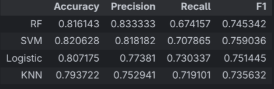

# Overview
This is my first Machine Learning project done to apply what I have learned in ML across the past couple months. In it I apply classification algorithms (Random Forest, SVM, Logistic Regression, etc) to the popular heart diseases and titanic data sets.
# Aim of the Project
I wanted to test my skills in data cleaning and engineering and my ability to choose the correct models for the tasks. As well as correctly reading the outcomes of the models to be able to determine whether the models are generalizing correctly or not. I also wanted to test my expertise when it comes to cleaning the data and engineering the features to give the best outcomes.
# Tools used
-   Pandas: for data exploration and cleaning.
-   Matplotlib: for visualizations to help me properly read the outcomes of my work on the data.
-   Scikit-learn: for the models used for prediction.
# Heart disease dataset

## The steps

### 1. Exploration
A simple overview on the data using pandas' dataframes. As well as using the Random Forest algorithm to find the importances of each feature.

```python
rf = RandomForestClassifier(n_estimators=200, max_depth=5, random_state=42)
rf.fit(xTrain, yTrain)

imp = rf.feature_importances_
indicies = np.argsort(imp)

plt.figure(figsize=(7, 5))
plt.barh(range(len(indicies)), imp[indicies], align="center")
plt.yticks(range(len(indicies)), X.columns[indicies])
plt.show()
```

### 2. Feature extraction
Considering the state the data came in was very clean and with all the data already being numeric there was nothing to be done when it came to data cleaning, so instead I moved on to feature extraction. The exploration I did in the previous step told me that while each feature had similar importance none of them were very important. So I attempted to extract features with more importance that could lead me to more accurate results using both manual feature extraction and by applying PCA.
```python
# Manual
xPruned = X.drop(list(y for x, y in enumerate(X.columns) if imp[x] <= 0.09), axis=1,inplace=False).copy()

# PCA
pca = PCA(n_components=5)
X_pca = pca.fit_transform(X)
```

### 3. Model Training
First and foremost I used Stratified K-Fold to apply cross validation on the training data in order to find any possible errors or imbalance.
```python
kf = StratifiedKFold(n_splits=5,random_state=42,shuffle=True)
cross_val_score(rf,xTrain,yTrain,cv=kf,scoring='accuracy')
```
Then I used the Grid Search to streamline the process of training multiple models and picking the best parameters for each model. I trained each model on all 3 data sets I had; the base data set, the PCA data set, and the data set with my manually extracted features.
```python
for model in graph_params.keys():
    # Training on the base dataset
    gridBase = GridSearchCV(
        estimator=models[model],
        param_grid=graph_params[model],
        cv=kf,
        n_jobs=-1,
        error_score="raise",
        scoring="accuracy",
    )
    gridBase.fit(xTrain, yTrain)
    bestModel = gridBase.best_estimator_
    yPred = bestModel.predict(xTest)
    acc = accuracy_score(yTest, yPred)
    prec = precision_score(yTest, yPred)
    rec = recall_score(yTest, yPred)
    f1 = f1_score(yTest, yPred)

    # Training on PCA data
    gridPCA = GridSearchCV(
        estimator=models[model],
        param_grid=graph_params[model],
        cv=kf,
        n_jobs=-1,
        error_score="raise",
        scoring="accuracy",
    )
    gridPCA.fit(xPcaTrain, yTrain)
    bestModel = gridPCA.best_estimator_
    yPred = bestModel.predict(xPcaTest)
    acc = accuracy_score(yTest, yPred)
    prec = precision_score(yTest, yPred)
    rec = recall_score(yTest, yPred)
    f1 = f1_score(yTest, yPred)

    # Training on pruned dataset
    gridPruned = GridSearchCV(
        estimator=models[model],
        param_grid=graph_params[model],
        cv=kf,
        n_jobs=-1,
        error_score="raise",
        scoring="accuracy",
    )
    gridPruned.fit(xPrunedTrain, yTrain)
    bestModel = gridPruned.best_estimator_
    yPred = bestModel.predict(xPrunedTest)
    acc = accuracy_score(yTest, yPred)
    prec = precision_score(yTest, yPred)
    rec = recall_score(yTest, yPred)
    f1 = f1_score(yTest, yPred)
```

## The results


As it can be clearly seen Logistic Regression on the base data set gave the best results in all metrics with 89% accuracy, 88% precision, 92% recall, and an F1 score of 90%. It is also interesting to note that none of the models trained on the PCA data had any higher scores, this is due to PCA being unable to properly do what it is meant to do due to this data having an already low number of features. Also, both the Decision Tree and the KNN models tended to have higher accurasies on the pruned data.

# Titanic Data set

## The steps

### 1. Exploration

Simple and quick exploration of the data using Pandas' dataframes.
```python
titanic_df=pd.read_csv('./titanic.csv')
titanic_df
titanic_df.shape
titanic_df.info()
titanic_df.describe()
```

### 2. Data cleaning and feature engineering

This data set had some immediately obvious problems that were easily found from the quick exploration, so I ironed them out before I did any exploration into the feature importances.
```python
titanic_df.drop(['PassengerId','Name','Cabin'],inplace=True,axis=1)
```
Firstly, I dropped the columns 'PassengerId', 'Name', and 'Cabin'. The first 2 I dropped because they give no useful information for the models and will instead lead the models astray from proper generalization. The 'Cabin' feature was dropped because it lacked a lot of samples, with ~700 missing samples, and due to the nature of this feature I could not find any way to fill the missing values without skewing the data and pulling the models away from correct predictions.
```python
titanic_df['Age'].fillna(titanic_df['Age'].mean(),inplace=True)
titanic_df['Embarked'].fillna(titanic_df['Embarked'].mode()[0],inplace=True)
```
Here I filled the missing values in the 'Age' and 'Embarked' columns. The missing values in the 'Age' column were filled with the mean value as it is a numeric feature, while the 'Embarked' column missing value were replaced with the most common value of the feature which I saw fit because there are only 2 missing values in the entire column so the models won't be affected much.
```python
titanic_df["Sex"] = titanic_df["Sex"].astype(str).map({"male": 1, "female": 0})
titanic_df["Embarked"] = (
    titanic_df["Embarked"].astype(str).map({"C": 1, "Q": 2, "S": 3})
)
titanic_df["Ticket"] = pd.to_numeric(
    titanic_df["Ticket"].astype(str).str.replace(r"\D", "", regex=True),errors='coerce'
).astype('Int64')
titanic_df['Ticket'].fillna(titanic_df['Ticket'].mode()[0],inplace=True)
```
These lines are for mapping string values in features to integers to make it easier for the models to read. The 'Ticket' column was made up of strings including numbers so I just removed all the non-numeric parts, but that led to a couple missing values so I then filled them.

### 3. Model training
Training was simple for this data set. Using Grid Search and Standard Scaler I trained Random Forest, SVM, Logistic Regression, and KNN on the data with varying parameters to find the best model for the job. Scaling is necessary here as the scales of the features vary a lot.
```python
scaler = StandardScaler()
xTrainScaled = scaler.fit_transform(xTrain)
xTestScaled = scaler.transform(xTest)

for model in grid_params.keys():
    grid = GridSearchCV(
        models[model],
        param_grid=grid_params[model],
        scoring="accuracy",
        cv=StratifiedKFold(n_splits=5, shuffle=True, random_state=42),
        error_score="raise",
        n_jobs=-1,
    )
    grid.fit(xTrainScaled, yTrain)
    bestModel = grid.best_estimator_
    yPred = bestModel.predict(xTestScaled)
    acc = accuracy_score(yTest, yPred)
    prec = precision_score(yTest, yPred, zero_division=0)
    rec = recall_score(yTest, yPred, zero_division=0)
    f1 = f1_score(yTest, yPred, zero_division=0)
```

## Results


All the models have very similar results, with SVM inching ahead to get the best accuracy, precision, recall, and F1 score. This is due to the cleaning and engineering I had previously done on the data along with the scaling which helped the models understand and generalize on the data much more easily.

# Conclusion
This simple project was a great introduction to the applications of Machine Learning. From all things data, to using the correct methods to find the best models for the job while catching any possible over-fitting or under-fitting. The tools provided by Pandas and Scikit-learn streamline the entire Machine Learning process but knowing how to use them correctly remains a fun and rewarding challenge. I look forward to doing more challenging projects on more complex and abstract data and finding ways to integrate Machine Learning into my other projects down the road.