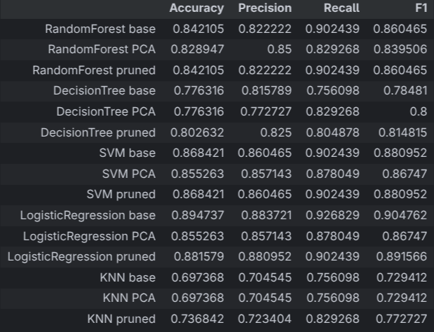

# Overview
This is my first Machine Learning project done to apply what I have learned in ML across the past couple months. In it I apply classification algorithms (Random Forest, SVM, Logistic Regression, etc) to the popular heart diseases and titanic data sets.
# Aim of the Project
I wanted to test my skills in data cleaning and engineering and my ability to choose the correct models for the tasks. As well as correctly reading the outcomes of the models to be able to determine whether the models are generalizing correctly or not. I also wanted to test my expertise when it comes to cleaning the data and engineering the features to give the best outcomes.
# Tools used
-   Pandas: for data exploration and cleaning.
-   Matplotlib: for visualizations to help me properly read the outcomes of my work on the data.
-   Scikit-learn: for the models used for prediction.
# Heart disease dataset

## The steps

### 1. Exploration
A simple overview on the data using pandas' dataframes. As well as using the Random Forest algorithm to find the importances of each feature.

```python
rf = RandomForestClassifier(n_estimators=200, max_depth=5, random_state=42)
rf.fit(xTrain, yTrain)

imp = rf.feature_importances_
indicies = np.argsort(imp)

plt.figure(figsize=(7, 5))
plt.barh(range(len(indicies)), imp[indicies], align="center")
plt.yticks(range(len(indicies)), X.columns[indicies])
plt.show()
```

### 2. Feature extraction
Considering the state the data came in was very clean and with all the data already being numeric there was nothing to be done when it came to data cleaning, so instead I moved on to feature extraction. The exploration I did in the previous step told me that while each feature had similar importance none of them were very important. So I attempted to extract features with more importance that could lead me to more accurate results using both manual feature extraction and by applying PCA.
```python
# Manual
xPruned = X.drop(list(y for x, y in enumerate(X.columns) if imp[x] <= 0.09), axis=1,inplace=False).copy()

# PCA
pca = PCA(n_components=5)
X_pca = pca.fit_transform(X)
```

### 3. Model Training
First and foremost I used Stratified K-Fold to apply cross validation on the training data in order to find any possible errors or imbalance.
```python
kf = StratifiedKFold(n_splits=5,random_state=42,shuffle=True)
cross_val_score(rf,xTrain,yTrain,cv=kf,scoring='accuracy')
```
Then I used the Grid Search to streamline the process of training multiple models and picking the best parameters for each model. I trained each model on all 3 data sets I had; the base data set, the PCA data set, and the data set with my manually extracted features.
```python
for model in graph_params.keys():
    # Training on the base dataset
    gridBase = GridSearchCV(
        estimator=models[model],
        param_grid=graph_params[model],
        cv=kf,
        n_jobs=-1,
        error_score="raise",
        scoring="accuracy",
    )
    gridBase.fit(xTrain, yTrain)
    bestModel = gridBase.best_estimator_
    yPred = bestModel.predict(xTest)
    acc = accuracy_score(yTest, yPred)
    prec = precision_score(yTest, yPred)
    rec = recall_score(yTest, yPred)
    f1 = f1_score(yTest, yPred)

    # Training on PCA data
    gridPCA = GridSearchCV(
        estimator=models[model],
        param_grid=graph_params[model],
        cv=kf,
        n_jobs=-1,
        error_score="raise",
        scoring="accuracy",
    )
    gridPCA.fit(xPcaTrain, yTrain)
    bestModel = gridPCA.best_estimator_
    yPred = bestModel.predict(xPcaTest)
    acc = accuracy_score(yTest, yPred)
    prec = precision_score(yTest, yPred)
    rec = recall_score(yTest, yPred)
    f1 = f1_score(yTest, yPred)

    # Training on pruned dataset
    gridPruned = GridSearchCV(
        estimator=models[model],
        param_grid=graph_params[model],
        cv=kf,
        n_jobs=-1,
        error_score="raise",
        scoring="accuracy",
    )
    gridPruned.fit(xPrunedTrain, yTrain)
    bestModel = gridPruned.best_estimator_
    yPred = bestModel.predict(xPrunedTest)
    acc = accuracy_score(yTest, yPred)
    prec = precision_score(yTest, yPred)
    rec = recall_score(yTest, yPred)
    f1 = f1_score(yTest, yPred)
```

## The results


As it can be clearly seen Logistic Regression on the base data set gave the best results in all metrics with 89% accuracy, 88% precision, 92% recall, and an F1 score of 90%. It is also interesting to note that none of the models trained on the PCA data had any higher scores, this is due to PCA being unable to properly do what it is meant to do due to this data having an already low number of features. Also, both the Decision Tree and the KNN models tended to have higher accurasies on the pruned data. 